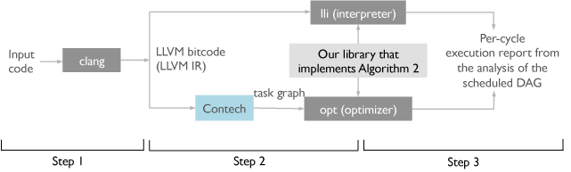

# ERM: Extended Roofline Model

# ERM flow

<object data="https://github.com/caparrov/ERM/files/1121412/erm-execution-flow-steps.pdf" type="application/pdf" width="700px" height="700px">
    <embed src="https://github.com/caparrov/ERM/files/1121412/erm-execution-flow-steps.pdf">
        This browser does not support PDFs. Please download the PDF to view it: <a href="https://github.com/caparrov/ERM/files/1121412/erm-execution-flow-steps.pdf">Download PDF</a>.

    </embed>
</object>

